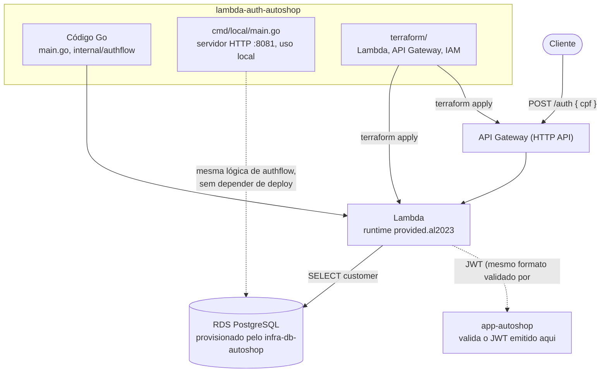

# lambda-auth-autoshop

Function Serverless de autenticação por CPF, exigida pela Fase 3. Não é
login com senha: o cliente informa o CPF, a function confirma que existe um
cadastro com esse CPF no banco (mesma tabela `customers` usada pelo
`app-autoshop`) e devolve um JWT — o mesmo formato de token que a API
principal já sabe validar (`pkg/auth/jwt.go` do `app-autoshop`).

Este é o repositório 1 dos 4 exigidos pela Fase 3 do Tech Challenge. Os
outros três: [`app-autoshop`](https://github.com/Jackeline2020/app-autoshop)
(aplicação), [`infra-k8s-autoshop`](https://github.com/Jackeline2020/infra-k8s-autoshop)
(cluster Kubernetes) e [`infra-db-autoshop`](https://github.com/Jackeline2020/infra-db-autoshop)
(banco gerenciado).

## Arquitetura deste repositório



A regra de negócio (validar CPF, checar existência e status do cliente,
emitir o token) vive isolada em `internal/authflow` e é reaproveitada tanto
pelo handler real da Lambda (`main.go`, via API Gateway) quanto por um
entrypoint de desenvolvimento local (`cmd/local/main.go`) — permite testar
o fluxo completo (CPF → JWT → rota protegida no `app-autoshop`) sem
depender de deploy na AWS a cada mudança.

## Fluxo

```bash
curl -X POST "$AUTH_ENDPOINT/auth" \
  -H "Content-Type: application/json" \
  -d '{"cpf": "529.982.247-25"}'
```

Respostas:

| Situação | Status | Body |
|---|---|---|
| CPF válido e cadastrado | 200 | `{"token": "<jwt>"}` |
| CPF com formato/dígito verificador inválido | 400 | `{"message": "CPF inválido"}` |
| Corpo da requisição malformado | 400 | `{"message": "corpo da requisição inválido"}` |
| CPF válido mas não cadastrado | 404 | `{"message": "cliente não encontrado"}` |
| CPF válido, cliente inativo | 403 | `{"message": "cliente inativo"}` |
| Erro de banco/token | 500 | `{"message": "..."}` |

O token gerado tem `user_id` (o ID do cliente) e `role: "customer"`, expira
em 24h, e é validado pelo `app-autoshop` com o mesmo `JWT_SECRET` — ver
[RFC-003](https://github.com/Jackeline2020/app-autoshop/blob/main/docs/rfc/RFC-003-estrategia-autenticacao.md)
no repositório `app-autoshop` para a justificativa completa da estratégia
de autenticação. Não há Swagger/OpenAPI aqui (é um único endpoint) — o
contrato de request/response está documentado na tabela acima e pode ser
testado direto com o `curl` acima ou importado no Insomnia/Postman a partir
dele.

## Por que Lambda + API Gateway

- **Lambda**: o caso de uso é uma chamada isolada, sem estado, de baixíssimo
  volume comparado à API principal — não justifica manter um serviço
  sempre ligado, e sem custo de execução parada (paga só por invocação).
- **API Gateway (HTTP API, não REST API)**: só precisamos de uma rota
  (`POST /auth`) com proxy direto pra Lambda — o modelo REST API do API
  Gateway traz recursos (API keys, request validation embutido, etc.) que
  não usamos aqui e custam mais caro por requisição.
- **`provided.al2023` (custom runtime) em vez de um runtime Go gerenciado**:
  a AWS descontinuou o runtime gerenciado `go1.x` — hoje o caminho oficial
  pra Go é compilar um binário chamado `bootstrap` e rodar em cima do
  runtime customizado `provided.al2023`.

## Tecnologias

- Go, runtime `provided.al2023` (binário `bootstrap`)
- AWS Lambda, API Gateway (HTTP API)
- Terraform (provider `aws`)
- `pgx` (mesmo driver PostgreSQL do `app-autoshop`), AWS Secrets Manager

## Pré-requisitos

- Go 1.26+
- Terraform >= 1.5
- `infra-db-autoshop` já aplicado (precisa do secret `autoshop/rds/credentials`)

## Variáveis de ambiente (injetadas pelo Terraform em runtime)

| Variável | Origem |
|---|---|
| `DB_HOST`, `DB_PORT`, `DB_NAME`, `DB_USER`, `DB_PASSWORD` | Lidas do secret `autoshop/rds/credentials` no Secrets Manager via `data "aws_secretsmanager_secret_version"` |
| `DB_SSLMODE` | Fixo em `require` — a Lambda sempre fala com o RDS real, nunca com um Postgres local |
| `JWT_SECRET` | Passado como variável Terraform (`-var="jwt_secret=..."`), vinda do GitHub Secret `JWT_SECRET` deste repositório. **Precisa ter o mesmo valor no `app-autoshop`**, senão a API principal não consegue validar os tokens que esta Lambda emite |

## Execução local (sem deploy)

```bash
cp .env.example .env
go run ./cmd/local
curl -X POST http://localhost:8081/auth -H "Content-Type: application/json" -d '{"cpf": "529.982.247-25"}'
```

Sobe o mesmo fluxo de `internal/authflow` como um servidor HTTP comum na
porta `:8081`, contra o Postgres configurado no `.env` — sem precisar de
deploy AWS pra testar o fluxo completo.

## Testes

```bash
go test ./...
```

## Build e deploy

```bash
GOOS=linux GOARCH=amd64 CGO_ENABLED=0 go build -o bootstrap main.go

cd terraform
terraform init
terraform plan -var="jwt_secret=<mesmo-valor-do-app-autoshop>"
terraform apply -var="jwt_secret=<mesmo-valor-do-app-autoshop>"
```

Depois do primeiro apply, copie o output `lambda_security_group_id` pra
variável `additional_db_ingress_security_group_ids` do Terraform em
`infra-db-autoshop`, e rode `terraform apply` lá de novo — é a única forma
da Lambda (que roda dentro da VPC, obrigatório pra alcançar o RDS) ter
acesso liberado na porta 5432 do banco.

## Pipeline CI/CD (`.github/workflows/ci-cd.yml`)

1. **test** — `go test ./...`.
2. **terraform-validate** — valida o Terraform em toda PR.
3. **deploy** — compila o `bootstrap` e roda `terraform apply` contra a
   AWS real, controlado pela variável de repositório `AWS_DEPLOY_ENABLED`.

Secrets necessários: `AWS_ROLE_ARN`, `JWT_SECRET`.
Variável: `AWS_DEPLOY_ENABLED`.
